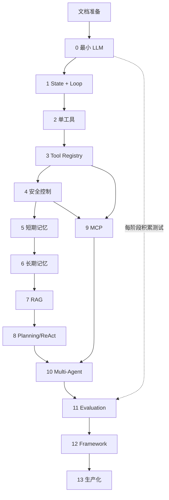

# 学习路线图

## 1. 路线原则

课程使用同一个项目持续演进。阶段 0～13 的顺序代表概念依赖，而不是功能菜单。任何阶段开始前必须回顾上一阶段，完成后必须测试、同步文档并等待确认。

每阶段统一要求：一个正常案例、一个边界案例、一个失败案例、至少一个自动化测试、一个手动验收步骤和明确完成标准。

## 2. 阶段总览

| 阶段 | 主要问题 | 新增主要抽象 | 可运行成果 | 预计时间 |
|---|---|---|---|---:|
| 0 最小 LLM 程序 | 如何完成一次可靠模型调用 | LLM Client | CLI 输入并输出模型回复；Fake LLM 可离线测试 | 3～5 小时 |
| 1 State 与 Loop | 如何围绕目标持续执行并终止 | AgentState、Agent Loop | 可观察的 Decide/Act/Observe 状态循环 | 5～7 小时 |
| 2 单工具调用 | 如何让模型请求、程序执行工具 | Calculator、Tool Call Schema | 完成结构化计算工具调用 | 5～7 小时 |
| 3 Tool Registry | 如何扩展多个工具而不堆叠分支 | Tool、ToolRegistry | 在多个低风险工具间路由 | 5～7 小时 |
| 4 安全与副作用 | 如何安全改变外部环境 | PermissionPolicy、Approval | 受限文件/Shell 操作及审计 | 7～10 小时 |
| 5 短期记忆 | 如何控制当前任务上下文 | WorkingMemory、ContextBuilder | 窗口、摘要、裁剪和 Token 预算 | 6～8 小时 |
| 6 长期记忆 | 如何跨会话保存有价值信息 | MemoryStore | SQLite 记忆 CRUD 与策略 | 5～7 小时 |
| 7 RAG | 如何基于外部证据回答 | Chunk、Embedder、Retriever | 本地知识库检索、回答和来源 | 9～12 小时 |
| 8 Planning/ReAct | 如何执行复杂多步骤任务 | Plan、Planner、Replanner | 计划、执行、观察和重规划 | 9～12 小时 |
| 9 MCP | 如何标准化连接外部能力 | MCP Client/Server/Adapter | 发现并调用 MCP 能力 | 7～10 小时 |
| 10 Multi-Agent | 何时角色协作优于单 Agent | Coordinator、角色 Schema | Planner/Executor/Reviewer 协作 | 7～10 小时 |
| 11 测试与评估 | 如何证明质量并防止回归 | EvalCase、EvalRunner、Metrics | 固定评估集和指标报告 | 8～12 小时 |
| 12 小型框架 | 哪些重复抽象值得保留 | AgentRuntime、扩展点 | 两个业务 Agent 复用 Runtime | 8～12 小时 |
| 13 生产化增强 | 如何诊断、约束和恢复运行 | RunContext、Checkpoint、Budget | 可追踪、受预算约束、可恢复运行 | 10～16 小时 |

总学习时间约 94～135 小时。每周投入 8～10 小时，预计 10～17 周；额外实验和笔记可能延长至 4～5 个月。

## 3. 各阶段输入、输出和完成要点

### 阶段 0：项目初始化与最小 LLM 程序

- 输入：文档准备阶段成果和学习者对阶段 0 的明确确认。
- 输出：最小 CLI、环境变量示例、官方 SDK 调用、Fake LLM 测试。
- 验收重点：正常问答、空输入、缺少 Key、离线测试。
- 不包含：Loop、Tool、Memory、RAG、MCP 或 Framework。

### 阶段 1：Agent State 与 Agent Loop

- 输入：阶段 0 可测试的一次性调用。
- 输出：目标、步骤、观察、错误、预算、完成状态以及全部终止原因。
- 验收重点：完成、主动失败、最大步数、取消和不可恢复错误均可终止。

### 阶段 2：单工具与 Function Calling

- 输入：阶段 1 显式循环和状态。
- 输出：Calculator Schema、结构化工具调用、参数校验、执行和 Observation。
- 验收重点：调用表达与实际执行清晰分离，非法参数不能进入工具。

### 阶段 3：Tool Registry 与多工具路由

- 输入：阶段 2 单工具闭环。
- 输出：统一 Tool 接口、Registry、低风险工具集和统一错误结果。
- 验收重点：正确选择、无需工具、未知工具和重复注册。

### 阶段 4：有副作用工具与安全控制

- 输入：阶段 3 Tool Registry。
- 输出：受限写文件、受限 Shell、权限策略、人工审批、超时和操作日志。
- 验收重点：越界、注入和未批准操作必须被代码拒绝。

### 阶段 5：Short-term Memory 与上下文管理

- 输入：可能产生多轮工具 Observation 的安全 Agent。
- 输出：任务工作记忆、最近窗口、摘要、裁剪和 Token 预算。
- 验收重点：保留关键目标并在上下文上限内工作。

### 阶段 6：Long-term Memory

- 输入：明确的当前任务状态与上下文边界。
- 输出：SQLite 记忆 CRUD、来源、时间、显式写入策略和删除权。
- 验收重点：跨会话读取、冲突处理、数据库失败不伪成功。

### 阶段 7：RAG 与知识库

- 输入：上下文构建能力和少量可验证本地文档。
- 输出：导入、清洗、切分、Embedding、索引、检索、上下文、来源和检索评估。
- 验收重点：能区分检索失败与生成失败，无证据时不编造来源。

### 阶段 8：Planning、Reasoning 与 ReAct

- 输入：Agent Loop、工具、记忆和检索能力。
- 输出：结构化计划、逐步执行、Observation、重试和重规划。
- 验收重点：复杂任务可调整计划并受步骤/重试预算约束。

### 阶段 9：MCP Server 与 MCP Client

- 输入：统一 Tool 接口和安全策略。
- 输出：最小 Server、Client、能力发现、调用、错误分类及 Tool Adapter。
- 验收重点：本地集成测试可重复；MCP 能力仍受权限控制。

### 阶段 10：Multi-Agent

- 输入：可规划、可调用本地/MCP 工具的单 Agent Runtime。
- 输出：Planner、Executor、Reviewer 的 Schema、通信、共享状态和全局终止条件。
- 验收重点：与单 Agent 基线比较质量、成本和延迟，避免循环讨论。

### 阶段 11：Agent Testing 与 Evaluation

- 输入：前面各阶段累计的测试和案例。
- 输出：Golden Dataset、评估运行器、工具/RAG/任务/安全/成本指标及回归阈值。
- 验收重点：API 故障与任务失败分离，LLM Judge 不作为唯一指标。

### 阶段 12：构建小型 Agent Framework

- 输入：已经重复出现且经过测试的组件。
- 输出：Agent Runtime、业务 Agent 配置和有限扩展点。
- 验收重点：至少两个业务 Agent 复用 Runtime，不为未来假想需求过度抽象。

### 阶段 13：生产化增强

- 输入：阶段 12 的小型 Framework 和阶段 11 评估基线。
- 输出：Run ID、结构化日志、重试退避、错误分类、幂等、预算、并发、降级、持久化和恢复。
- 验收重点：可通过 Run ID 调查故障；中断后可安全恢复；所有预算真实生效。

## 4. 依赖关系

## 5. 模型与技术建议

### 建议方案

- Python 3.11+、CLI、uv、pytest、Pydantic、SQLite。
- 阶段 0 已由学习者选择硅基流动，使用 OpenAI Python SDK 调用其兼容的 Chat Completions API。
- 当前模型为 `deepseek-ai/DeepSeek-V4-Flash`；每个涉及模型能力的阶段开始前仍须重新核对可用性、参数、价格和账号权限。
- 复杂规划或评估可选更高能力模型，但不是默认要求。

### 备选方案

- Anthropic 官方 Python SDK 与 Messages API；具体 Claude Sonnet 型号在实施时核对官方文档。
- 如果环境无法使用 uv，可改用 venv + pip，但必须记录决定并保证可复现锁定。

### 待确认项

- 阶段 0 的供应商、模型和 SDK 版本；
- RAG 的 Embedding 与向量存储；
- MCP SDK 与通信方式；
- 是否创建每阶段 tag；
- 是否在阶段 12 之后制作成熟框架迁移版本。

## 6. 课程停止规则

阶段完成并同步文档后必须停止。路线图更新、准备工作或故障修复都不构成进入下一阶段的授权。
